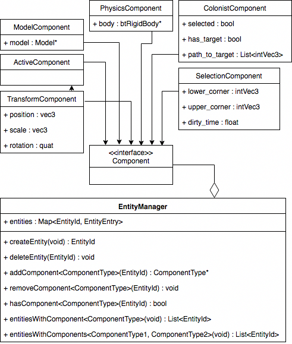

# Game Of Stones

More info: [alexsaalberg.com/gos.html](https://alexsaalberg.com/gos.html)

## Description

Game of Stones was my senior project. It was created in a little under 10 weeks. 

It was meant to be an exploration into the type of speciality controls that might be needed to make a fully-3D "Colony Simulator" type game. (Imagine [Rimworld](https://rimworldgame.com/) rendered in Minecraft). 

Most of the time was spent simply making the rendering engine, but some basic controllable 'colonists' npcs were added as well as some interesting 3D voxel building controls

## Technologies

Language - C++

Source Control - Git

Building - CMake1
### Libraries

#### [Polyvox](http://www.volumesoffun.com/polyvox-about/)

Used for management of voxel data, generation of triangle meshes from voxel data, and for some of it's pathfinding utility functions.

#### [BulletPhysics3](https://github.com/bulletphysics/bullet3)

Used for physics simulation (duh).

#### [Glad](https://github.com/Dav1dde/glad)

Used for loading OpenGL functions.

#### [Imgui](https://github.com/ocornut/imgui)

User for debug output.

## Controls
  It’s important to understand that there are two conceptual “control modes” in this game. They are called “RTS mode” and “FPS mode.” They can be switched between by hitting the “G” key. There are some controls that are available in both modes.
  
  In FPS mode it is easier to move around and place/destroy individual blocks. Controls in this mode are fairly identical to the game ‘Minecraft’. (Left Click to destroy, Right Click to build).
  
  In RTS mode it is possible to select (LeftClick) and direct (RightClick) colonists (the grey cubes). It is also possible to select 3D volumes of the world (LeftMouse+Drag). Once a volume is selected it can be used to select multiple colonists at once, or destroy and build blocks.

Here is a summary of the controls available
#### Both Modes
* WASD to move
* Space to jump
* 1-9 select block color 
* Hit G to switch control modes

#### FPS Mode
* Move Mouse to change camera
* Left Click to destroy
* Right Click to build

#### RTS Mode
* Hold Right-Click and Move Mouse to change camera
* Left-Click to select a colonist
* Right-Click to tell all selected colonists to move somewhere
* Left-Drag to create a selection
  * Hit B to build in selection
  * Hit V to delete in selection
  * Hit C or Left-Click to cancel selection
  * Hit F to select colonists in selection

# Behind The Scenes

## Entity-Component-System-(Manager?) Pattern

### Background Info

Game of Stones uses the [ECS Programming Pattern](https://en.wikipedia.org/wiki/Entity%E2%80%93component%E2%80%93system) to define it's game objects. This pattern favors "composition over inheritence" and is generally used to combat the problems that game engines can have of using traditional object inheritance to define hundreds of different game objects with overlapping, but slightly differing, properties.

ECS is used in game engines both because of the possible performance benefits due to better [data locality](http://gameprogrammingpatterns.com/data-locality.html), and because it can make the engine simplier and easier to develop. 

### Implementation

This part of the engine was implemented in a fairly straightforward fashion. Each entity is nothing more than an ID (int). Each component type has its’ own storage manager which ultimately stores all components of the same type in a contiguous array or a hashmap. There is roughly one system for each game mechanic (e.g. RenderSystem, PhysicsSystem, ColonistSystem) which is automatically called each frame or physics step and can query the EntityManager to get entities with one or more components as needed. For example, every frame the RenderSystem renders every entity with a TransformComponent and a ModelComponent.

### Systems

ChunkSystem
* Receives click events from InputSystem and processes them asynchronously (creating or destroying blocks as necessary)
* On each Physics Step 
  * Calculates which chunks are within view-range and loads/unloads them as necessary. (Like in minecraft)
  * Calls PolyVox to created MeshData for newly loaded chunks. (Limits how many are created per step to prevent lag).
* On each Graphics Frame
  * Renders the meshdata for all loaded chunks.

ColonistSystem
* On each Physics Step
  * For each colonist which has a target destination
    * move them towards the next point on the A* path towards the destination.
    * Jump if necessary
InputSystem
* On each Physics Step
  * For each control in control_map (Can contain mouse or key controls)
    * See if that control was activate in the last step
    * (Incoming controls are managed by GLFW)
* PhysicsSystem
  * 
* PickSystem
* PlayerSystem
* RenderSystem
* SelectionSystem
* VolumeRenderSystem

### Components

*NOTE!: Ignore the erroneous arrow between TransformComponent and ActiveComponent*

## Naming Conventions
* Variables (local and member)
  * snake_case 
* Classes
  * PascalCase
* Functions
  * camelCase

